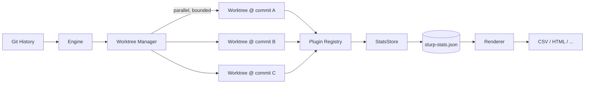

# slurp

Git history analytics with pluggable analysis and rendering.

slurp iterates over your repository's commit history using parallel git worktrees, runs analysis plugins against each commit's checked-out source tree, and aggregates results into an incremental JSON stats file. Subsequent runs only process new or rebased commits.

## Table of Contents

- [How It Works](#how-it-works)
- [Prerequisites](#prerequisites)
- [Installation](#installation)
- [Usage](#usage)
  - [Analyzing a Repository](#analyzing-a-repository)
  - [Rendering Output](#rendering-output)
  - [Stats File Format](#stats-file-format)
- [Architecture](#architecture)
- [Extending slurp](#extending-slurp)
  - [Writing a Plugin](#writing-a-plugin)
  - [Writing a Renderer](#writing-a-renderer)
- [Development](#development)

## How It Works



1. **Engine** reads the full commit log and loads any existing stats file.
2. It **reconciles** the current commit list against stored results, determining which commits are new, rebased, or already processed.
3. For each commit that needs work, the **WorktreeManager** creates a temporary git worktree at that commit SHA. Multiple worktrees run in parallel (bounded by the concurrency setting).
4. The **PluginRegistry** runs all discovered plugins against each worktree's checked-out source tree.
5. Results are written to an incremental **JSON stats file** with atomic writes and lock-file coordination.
6. The **render** command reads the stats file and outputs it in a chosen format.

### Incremental Processing

On repeat runs, slurp avoids redundant work:

- **Unchanged commits** are carried over from the existing stats file.
- **Rebased commits** are detected via `git patch-id` and reprocessed.
- **Gap-fill**: when a new plugin is added, only the missing plugin is run against existing commits.
- **Merge commits** are skipped by default (use `--process-merges` to include them).

## Prerequisites

- **Node.js** 22+
- **pnpm** 10+ (`corepack enable && corepack prepare pnpm@latest --activate`)
- **git** (with worktree support)

## Installation

Clone and build the monorepo:

```bash
git clone <repo-url>
cd slurp
pnpm install
pnpm run build
```

To make the `slurp` command available globally:

```bash
cd packages/cli
npm link
```

Verify installation:

```bash
slurp --help
```

## Usage

### Analyzing a Repository

```bash
slurp run [repo] [options]
```

**Arguments and options:**

| Option | Short | Default | Description |
|--------|-------|---------|-------------|
| `repo` | | `.` | Path to the git repository to analyze |
| `--output` | `-o` | `./slurp-stats.json` | Path for the output stats file |
| `--concurrency` | `-c` | `4` | Max parallel worktrees |
| `--plugin` | | (all) | Run only the named plugin(s). Repeatable |
| `--process-merges` | | `false` | Include merge commits in analysis |
| `--dry-run` | | `false` | Show what would be processed without running |

**Examples:**

```bash
# Analyze the current directory with default settings
slurp run

# Analyze a different repo, output to a custom path
slurp run ../other-repo -o ./stats.json

# Run with 8 parallel worktrees
slurp run -c 8

# Run only the linecount plugin
slurp run --plugin linecount

# Preview what would be processed without executing
slurp run --dry-run

# Include merge commits
slurp run --process-merges
```

### Rendering Output

```bash
slurp render --input <stats.json> --output <out.csv> --format <format>
```

**Options:**

| Option | Short | Description |
|--------|-------|-------------|
| `--input` | `-i` | Path to the stats JSON file |
| `--output` | `-o` | Path for the rendered output file |
| `--format` | | Output format (`csv`) |

**Example:**

```bash
slurp render -i slurp-stats.json -o report.csv --format csv
```

### Stats File Format

The stats file is a JSON document with the following shape:

```json
{
  "version": "1.0.0",
  "slurpVersion": "0.1.0",
  "repo": {
    "path": ".",
    "head": "5b2ee063440b..."
  },
  "plugins": [
    { "name": "linecount", "version": "0.1.0" }
  ],
  "commits": [
    {
      "sha": "67c0a65c7115...",
      "abbreviatedSha": "67c0a65",
      "parents": ["faff995eac4c..."],
      "authorName": "Jane Doe",
      "authorEmail": "jane@example.com",
      "authorDate": "2026-06-19T23:47:14-04:00",
      "commitDate": "2026-06-19T23:47:14-04:00",
      "subject": "feat: add cool thing",
      "message": "feat: add cool thing\n\nDetailed body...",
      "patchId": "935112a7b285...",
      "processedPlugins": ["linecount"],
      "results": {
        "linecount": {
          "totalLines": 7257,
          "byExtension": {
            ".ts": 2977,
            ".json": 615
          }
        }
      }
    }
  ]
}
```

Each plugin's result object shape is entirely up to the plugin. slurp stores whatever the plugin returns.

## Architecture

slurp is a **pnpm monorepo** built on [Effect-TS](https://effect.website). All services are modeled as `Context.Tag` services with `Layer`-based implementations, using schema-validated data models and `TaggedError` error types throughout.

### Packages

| Package | Description |
|---------|-------------|
| `@slurp/plugin` | Plugin SDK: interfaces and helpers for writing plugins |
| `@slurp/core` | Core engine, git service, worktree manager, plugin discovery/registry, stats store |
| `@slurp/cli` | CLI entry point with `run` and `render` subcommands |
| `@slurp/plugin-linecount` | Reference plugin that counts lines of code by file extension |
| `@slurp/renderer-csv` | CSV renderer |

### Core Services

- **GitService**: Wraps git operations (commit log, patch-id, worktree add/remove, HEAD resolution).
- **WorktreeManager**: Creates scoped temporary worktrees with automatic cleanup. Prunes orphaned worktrees on startup.
- **PluginDiscovery**: Scans both global (`npm root -g`) and local `node_modules` for packages that depend on `@slurp/plugin`. Imports their default export and validates the plugin shape.
- **PluginRegistry**: Holds discovered plugins immutably. Runs plugins against an `AnalyzeContext`, collecting results as a discriminated union of success/failure.
- **StatsStore**: Loads and saves the stats JSON file with schema validation, atomic writes (temp file + rename), and lock-file coordination.
- **Engine**: Orchestrates the full pipeline: reconcile commits against existing stats, process work items in parallel, assemble final stats file.

## Extending slurp

### Writing a Plugin

A plugin is any npm package that:
1. Declares `@slurp/plugin` as a dependency (peer, dev, or regular)
2. Exports a `SlurpPluginDefinition` as its **default export**

#### Plugin Interface

```typescript
import type { AnalyzeContext } from "@slurp/plugin"
import type { Effect } from "effect/Effect"
import type { Schema } from "effect/Schema"
import type { PluginError } from "@slurp/plugin"

interface SlurpPluginDefinition {
  readonly name: string
  readonly version: string
  readonly analyze: (ctx: AnalyzeContext) => Effect.Effect<unknown, PluginError>
  readonly resultSchema?: Schema.Schema<unknown, unknown, unknown>
}

interface AnalyzeContext {
  readonly worktreePath: string
  readonly commit: CommitInfo
  readonly repoPath: string
}

// CommitInfo fields: sha, abbreviatedSha, parents, authorName,
// authorEmail, authorDate, commitDate, subject, message
```

The `analyze` function receives an `AnalyzeContext` with the path to a checked-out worktree at the commit's state, plus commit metadata. It returns an `Effect` that resolves to an arbitrary JSON-serializable value (stored as the plugin's result for that commit). Failures should be `PluginError`.

#### Minimal Plugin Example

```typescript
// src/index.ts
import { definePlugin, PluginError } from "@slurp/plugin"
import * as Effect from "effect/Effect"
import * as FileSystem from "@effect/platform/FileSystem"
import { NodeContext } from "@effect/platform-node"

export default definePlugin({
  name: "filecount",
  version: "0.1.0",
  analyze: (ctx) =>
    Effect.gen(function* () {
      const fs = yield* FileSystem.FileSystem
      const entries = yield* fs
        .readDirectory(ctx.worktreePath, { recursive: true })
        .pipe(Effect.catchAll(() => Effect.succeed([] as string[])))

      const files = entries.filter(
        (e) => !e.startsWith(".git/") && !e.startsWith("node_modules/")
      )

      return { totalFiles: files.length }
    }).pipe(Effect.provide(NodeContext.layer)),
})
```

#### Package Setup

```json
{
  "name": "@your-org/slurp-plugin-filecount",
  "version": "0.1.0",
  "type": "module",
  "exports": {
    ".": {
      "import": "./build/esm/index.js",
      "default": "./build/esm/index.js"
    }
  },
  "peerDependencies": {
    "@slurp/plugin": "^0.1.0",
    "effect": "^3.21.4"
  }
}
```

#### Key Points

- **Default export**: The plugin must be the **default** export of the entry point. Named exports are ignored.
- **`@slurp/plugin` dependency**: The package's `package.json` must list `@slurp/plugin` in `dependencies`, `devDependencies`, `peerDependencies`, or `optionalDependencies`. This is how plugin discovery identifies plugins.
- **Effect runtime**: Plugins run inside an Effect workflow. If your plugin uses `@effect/platform` services (FileSystem, Path, etc.), provide the Node layer (`NodeContext.layer`) within your `analyze` function.
- **Error handling**: Return `PluginError` for expected failures. Unexpected errors are caught by the engine and logged as warnings; processing continues with other commits/plugins.
- **Discovery**: Plugins are discovered automatically. Install your plugin package globally (`npm install -g`) or in the target repo's `node_modules`, and slurp will find it on the next run.

See `packages/plugin-linecount/src/index.ts` for a complete reference implementation.

### Writing a Renderer

A renderer reads the stats JSON file and writes output in a specific format. Renderers are currently registered in the CLI's `Commands.ts` (not auto-discovered).

#### Renderer Interface

```typescript
import { StatsFile, RenderError } from "@slurp/core"
import * as Effect from "effect/Effect"
import * as FileSystem from "@effect/platform/FileSystem"

interface RenderOptions {
  readonly input: string   // path to stats JSON
  readonly output: string  // path for rendered output
}

const render = (options: RenderOptions): Effect.Effect<void, RenderError, FileSystem.FileSystem>
```

A renderer:
1. Reads and parses the stats JSON file.
2. Validates it against the `StatsFile` schema.
3. Transforms the data into the desired format.
4. Writes the result to the output path.

See `packages/renderer-csv/src/index.ts` for the complete CSV renderer implementation.

#### Registering a Renderer

To add a new renderer to the CLI:

1. Create a new package (e.g., `@slurp/renderer-html`) exporting a `render` function and a renderer object (like `csvRenderer`).
2. Import it in `packages/cli/src/Commands.ts`.
3. Add it to the `renderers` map and the `--format` choice array.

```typescript
// In Commands.ts
import { htmlRenderer } from "@slurp/renderer-html"

const renderers = { csv: csvRenderer, html: htmlRenderer }

// Update the format choice:
// Options.choice("format", ["csv", "html"] as const)
```

## Development

```bash
# Install dependencies
pnpm install

# Type check (uses TypeScript project references)
pnpm run check

# Build all packages
pnpm run build

# Run tests
pnpm test

# Lint
pnpm run lint

# Clean build artifacts
pnpm run clean
```

### Project Structure

```
slurp/
|-- packages/
|   |-- plugin/            # @slurp/plugin: Plugin SDK
|   |-- core/              # @slurp/core: Engine, services, schemas
|   |-- cli/               # @slurp/cli: CLI entry point
|   |-- plugin-linecount/  # @slurp/plugin-linecount: Reference plugin
|   `-- renderer-csv/      # @slurp/renderer-csv: CSV renderer
|-- scripts/
|   `-- clean.mjs          # Build artifact cleanup
|-- tsconfig.base.json     # Shared TypeScript config
|-- tsconfig.json          # Type check project references
|-- tsconfig.build.json    # Build project references
|-- vitest.config.ts       # Test configuration
`-- eslint.config.mjs      # Lint configuration
```
